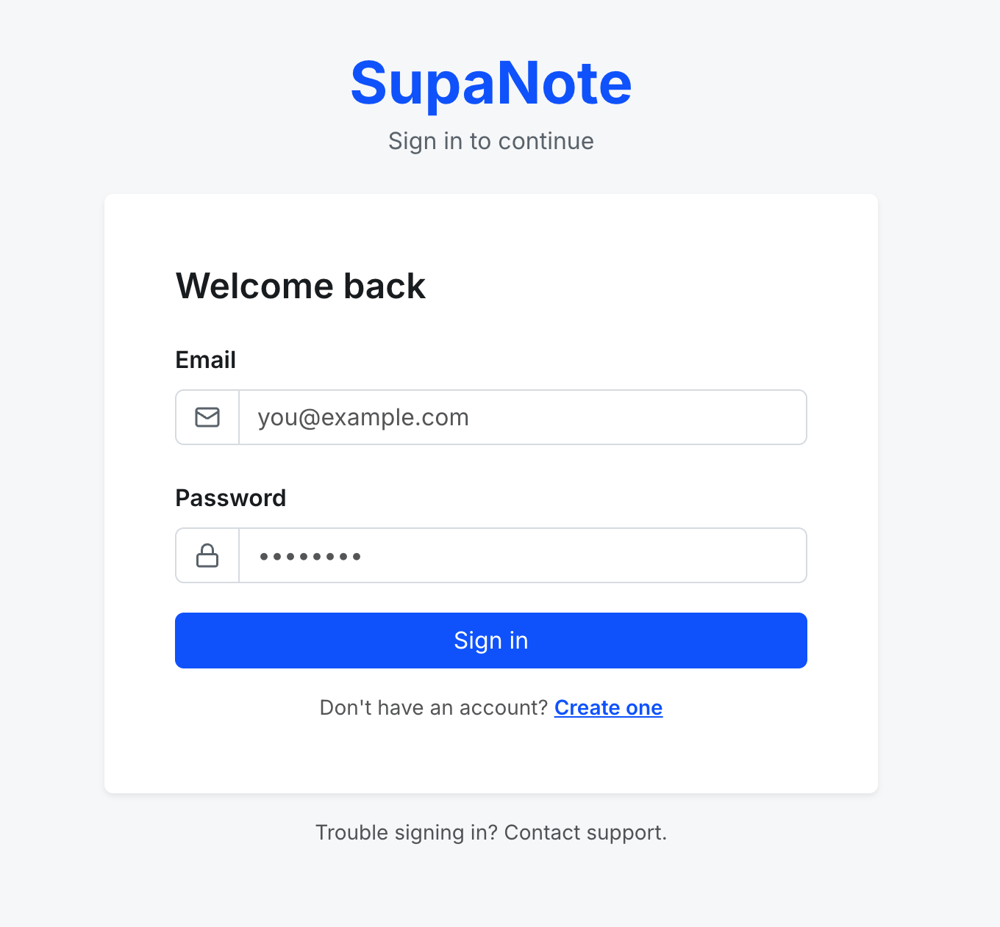
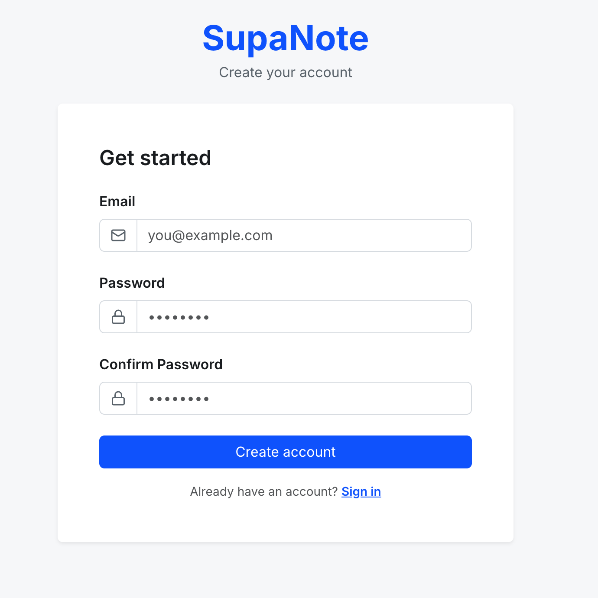
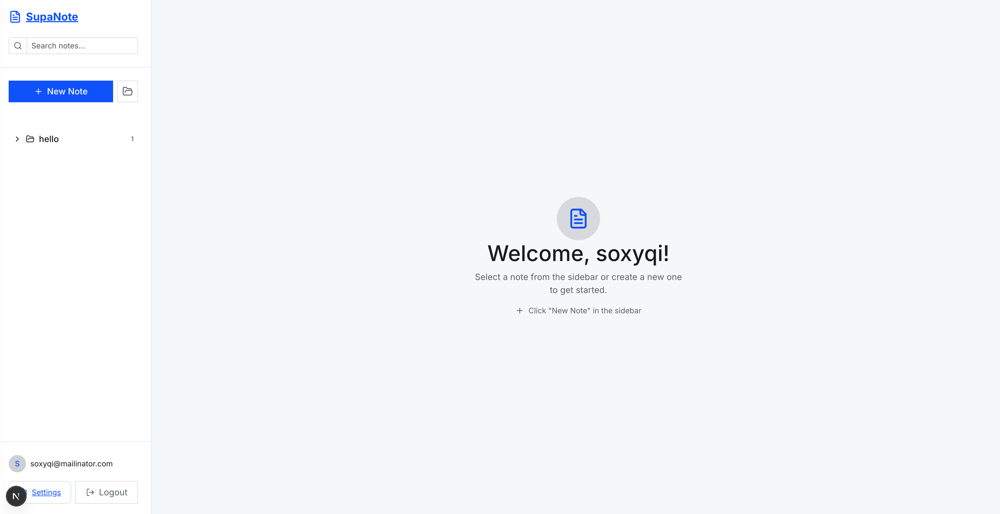
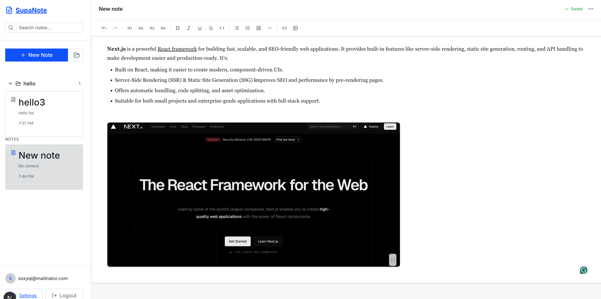

# SupaNote 📝

<p align="center">
  
  
  
  
  
  
  
  
</p>

A modern, full-stack Notes App built with **Next.js 16.0.8** (frontend), **FastAPI** (backend), and **Supabase** (Auth, Database, Storage). Features a beautiful memo-style UI, rich text editing with TipTap, image paste support, auto-save, and folder organization.

---

## 📸 Screenshots

### Login & Signup
<p align="center">
  
  
</p>

### Dashboard


### Rich Text Editor


---

## ✨ Features

### 📝 Notes Management
- **CRUD Operations** - Create, read, update, delete notes
- **Auto-save** - Changes are automatically saved with debouncing
- **Folder Organization** - Organize notes into folders
- **Search** - Quick search across all notes

### ✍️ Rich Text Editor (TipTap)
- **Text Formatting** - Bold, italic, underline, strikethrough
- **Headings** - H1 to H4 support
- **Lists** - Bullet and numbered lists
- **Links** - Hyperlink support
- **Code** - Inline code formatting
- **Blockquotes** - Quote styling
- **Undo/Redo** - Full history support
- **Keyboard Shortcuts** - Ctrl+B, Ctrl+I, etc.

### 🖼️ Image Support
- **Paste / Drag & Drop / Upload** - Multiple ways to add images
- **Responsive Defaults** - Inserts at 320px width with responsive max-width
- **Resize & Move** - Drag handle to resize; drag image to reposition
- **Supabase Storage** - Secure cloud storage

### 🎨 UI & Navigation
- **Bootstrap + Tailwind** - Bootstrap 5.3 styling with selective Tailwind utilities
- **Auth & Settings** - Refreshed Bootstrap cards, forms, and modals
- **Sidebar** - Live note-title updates while editing; modal-based folder creation
- **Clean Editor Canvas** - No horizontal lines; rounded, bordered surface
- **Responsive** - Works on mobile, tablet, desktop

### 🔐 Authentication
- **Email/Password** - Secure authentication
- **Session Management** - Persistent sessions
- **Protected Routes** - Middleware-based protection

---

## 📁 Project Structure

```
supanote-monorepo/
├── apps/
│   ├── web/                    # Next.js 19.2 Frontend
│   │   ├── app/               # App Router pages
│   │   │   ├── auth/          # Auth pages (login, signup)
│   │   │   ├── notes/[id]/    # Note editor page
│   │   │   ├── folders/[id]/  # Folder view page
│   │   │   └── settings/      # Settings page
│   │   ├── components/        # React components
│   │   │   ├── auth/          # Auth forms
│   │   │   ├── Editor.tsx     # TipTap editor
│   │   │   ├── Sidebar.tsx    # Navigation sidebar
│   │   │   └── ...
│   │   ├── lib/               # Utilities
│   │   │   └── supabase/      # Supabase clients
│   │   └── middleware.ts      # Auth middleware
│   │
│   └── api/                    # FastAPI Backend
│       ├── app/
│       │   ├── core/          # Config, auth, Supabase
│       │   ├── models/        # Pydantic models
│       │   ├── routers/       # API routes
│       │   └── main.py        # FastAPI app
│       └── requirements.txt
│
├── packages/
│   ├── ui/                     # Shared UI components
│   ├── types/                  # Shared TypeScript types
│   └── config/                 # Shared configs
│
├── supabase/
│   ├── config.toml            # Local dev config
│   └── migrations/            # SQL migrations
│
├── turbo.json                  # Turborepo config
├── pnpm-workspace.yaml         # pnpm workspace
└── package.json                # Root package.json
```

---

## 🚀 Getting Started

### Prerequisites

- **Node.js** >= 20.0.0
- **pnpm** >= 9.0.0
- **Python** >= 3.11
- **Supabase Account** - [Sign up free](https://supabase.com)

### 1. Clone the Repository

```bash
git clone https://github.com/HariKrishna-9885699666/notebook-next-fastapi.git
cd notebook-next-fastapi
```

### 2. Install Dependencies

```bash
# Install Node.js dependencies
pnpm install

# Install Python dependencies
cd apps/api
python -m venv .venv
source .venv/bin/activate  # On Windows: .venv\Scripts\activate
pip install -r requirements.txt
cd ../..
```

### 3. Setup Supabase

1. Create a new project at [supabase.com](https://supabase.com)
2. Go to **SQL Editor** and run the migrations:
   - `supabase/migrations/20241210000001_create_tables.sql`
   - `supabase/migrations/20241210000002_create_storage.sql`
3. Get your API keys from **Settings > API**

### 4. Configure Environment Variables

```bash
# Copy example env files
cp .env.example .env
cp apps/web/.env.example apps/web/.env
cp apps/api/.env.example apps/api/.env
```

Edit each `.env` file with your Supabase credentials:

```env
# apps/web/.env
NEXT_PUBLIC_SUPABASE_URL=https://your-project.supabase.co
NEXT_PUBLIC_SUPABASE_ANON_KEY=your-anon-key
NEXT_PUBLIC_API_URL=http://localhost:8000

# apps/api/.env
SUPABASE_URL=https://your-project.supabase.co
SUPABASE_ANON_KEY=your-anon-key
SUPABASE_SERVICE_ROLE_KEY=your-service-role-key
```

### 5. Run Development Servers

```bash
# Run both frontend and backend
pnpm dev

# Or run individually:
pnpm dev:web  # Next.js on http://localhost:3000
pnpm dev:api  # FastAPI on http://localhost:8000
```

---

## 📜 Scripts

| Command | Description |
|---------|-------------|
| `pnpm dev` | Start all apps in development mode |
| `pnpm dev:web` | Start Next.js frontend only |
| `pnpm dev:api` | Start FastAPI backend only |
| `pnpm build` | Build all apps for production |
| `pnpm lint` | Run linting across all apps |
| `pnpm clean` | Clean build artifacts |
| `pnpm format` | Format code with Prettier |

---

## 🗄️ Database Schema

```
┌─────────────────────────┐     ┌─────────────────────────┐
│        folders          │     │          notes          │
├─────────────────────────┤     ├─────────────────────────┤
│ id (uuid, PK)           │◄────┤ folder_id (uuid, FK)    │
│ user_id (uuid, FK)      │     │ id (uuid, PK)           │
│ name (text)             │     │ user_id (uuid, FK)      │
│ created_at (timestamptz)│     │ title (text)            │
└─────────────────────────┘     │ content (text)          │
                                │ created_at (timestamptz) │
                                │ updated_at (timestamptz) │
                                └─────────────────────────┘
```

### Row Level Security (RLS)

All tables have RLS enabled ensuring users can only access their own data:
- `user_id = auth.uid()` policy on all operations

---

## 🔌 API Endpoints

### Notes

| Method | Endpoint | Description |
|--------|----------|-------------|
| GET | `/notes` | Get all notes |
| GET | `/notes/{id}` | Get note by ID |
| POST | `/notes` | Create new note |
| PUT | `/notes/{id}` | Update note |
| DELETE | `/notes/{id}` | Delete note |

### Folders

| Method | Endpoint | Description |
|--------|----------|-------------|
| GET | `/folders` | Get all folders |
| GET | `/folders/{id}` | Get folder by ID |
| POST | `/folders` | Create new folder |
| PUT | `/folders/{id}` | Update folder |
| DELETE | `/folders/{id}` | Delete folder |

### Upload

| Method | Endpoint | Description |
|--------|----------|-------------|
| POST | `/upload/image` | Upload image |
| DELETE | `/upload/image/{path}` | Delete image |

API documentation available at: `http://localhost:8000/docs`

---

## 🏗️ Architecture

```
┌──────────────────────────────────────────────────────────────┐
│                         Client                                │
│                    (Browser/Mobile)                           │
└─────────────────────────┬────────────────────────────────────┘
                          │
┌─────────────────────────▼────────────────────────────────────┐
│                    Next.js Frontend                           │
│        (React 19 + TipTap + Tailwind + Bootstrap)            │
│                   localhost:3000                              │
└─────────────────────────┬────────────────────────────────────┘
                          │
          ┌───────────────┴───────────────┐
          │                               │
          ▼                               ▼
┌─────────────────────────┐   ┌─────────────────────────┐
│    Supabase Client      │   │    FastAPI Backend      │
│   (Auth, Realtime)      │   │  (Business Logic, API)  │
│                         │   │    localhost:8000       │
└─────────────────────────┘   └───────────┬─────────────┘
          │                               │
          └───────────────┬───────────────┘
                          │
                          ▼
┌──────────────────────────────────────────────────────────────┐
│                       Supabase                                │
│  ┌──────────────┐  ┌──────────────┐  ┌──────────────┐       │
│  │  PostgreSQL  │  │     Auth     │  │   Storage    │       │
│  │  (Database)  │  │  (JWT/Email) │  │   (Images)   │       │
│  └──────────────┘  └──────────────┘  └──────────────┘       │
└──────────────────────────────────────────────────────────────┘
```

---

## 🎨 UI Theme

Current palette (Bootstrap-friendly):

| Color | Hex | Usage |
|-------|-----|-------|
| Paper | `#f8f9fa` | Background |
| Line | `#e9ecef` | Borders |
| Primary | `#0d6efd` | Primary actions |
| Primary Dark | `#0b5ed7` | Hover states |
| Accent | `#6c757d` | Secondary text/borders |
| Text | `#212529` | Primary text |
| Text Muted | `#6c757d` | Secondary text |

---

## 🛠️ Tech Stack

### Frontend
- **Next.js 16.0.8** - React framework with App Router
- **React 19.2** - UI library
- **TipTap 2.10** - Rich text editor with custom image resize & drag
- **Tailwind CSS 4.1 + Bootstrap 5.3 (CDN)** - Styling
- **Lucide React** - Icons
- **Supabase SSR** - Auth & database client

### Backend
- **FastAPI 0.115** - Python web framework
- **Pydantic 2.10** - Data validation
- **Supabase Python** - Database & auth client
- **Uvicorn** - ASGI server

### Infrastructure
- **Turborepo** - Monorepo build system
- **pnpm** - Package manager
- **Supabase** - Backend-as-a-Service

---

## 📄 License

This project is licensed under the MIT License.

---

## 🤝 Contributing

Contributions are welcome! Please feel free to submit a Pull Request.

1. Fork the repository
2. Create your feature branch (`git checkout -b feature/AmazingFeature`)
3. Commit your changes (`git commit -m 'Add some AmazingFeature'`)
4. Push to the branch (`git push origin feature/AmazingFeature`)
5. Open a Pull Request

---

<p align="center">
  Made with ❤️ by <a href="https://github.com/HariKrishna-9885699666">Hari Krishna</a>
</p>
